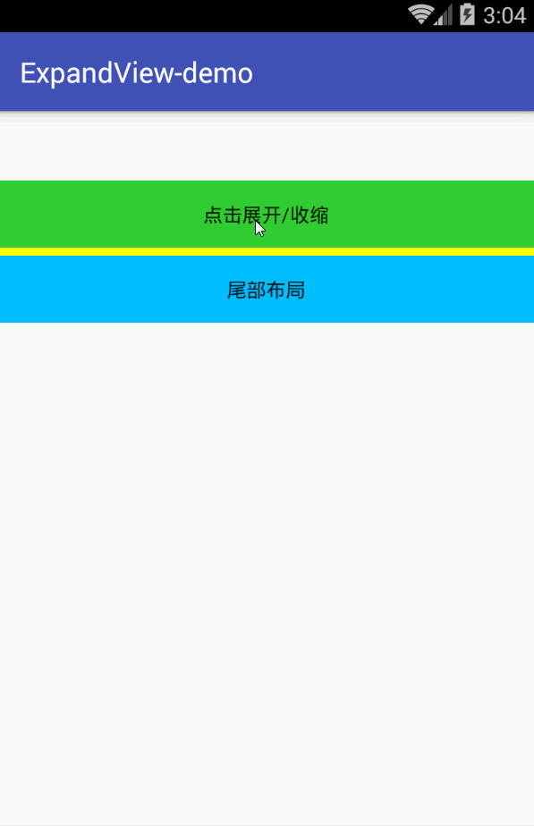

#ExpandLayout

## 简介
由于界面View.VISIBLE和View.GONE的动画太生硬，所以写了ExpandLayout类来平滑过渡。
基本思路，动态的设置布局的高度。
com.zxn.expand.ExpandLayout


- 核心动画效果代码

```java
/**
 * 切换动画实现
 */
private void animateToggle(long animationDuration) {
    ValueAnimator heightAnimation = isExpand ?
            ValueAnimator.ofFloat(0f, viewHeight) : ValueAnimator.ofFloat(viewHeight, 0f);
    heightAnimation.setDuration(animationDuration / 2);
    heightAnimation.setStartDelay(animationDuration / 2);

    heightAnimation.addUpdateListener(new ValueAnimator.AnimatorUpdateListener() {
        @Override
        public void onAnimationUpdate(ValueAnimator animation) {
            float val = (float) animation.getAnimatedValue();
            setViewHeight(layoutView, (int) val);
        }
    });

    heightAnimation.start();
}
```

## 效果预览




## 使用
因为ExpandLayout继承RelativeLayout，所以可以在布局内直接包含控件

- 添加配置
```
implementation 'com.zxn.expand:expand-layout:1.0.0'
```

- 布局文件中

```
<LinearLayout xmlns:android="http://schemas.android.com/apk/res/android"
    xmlns:app="http://schemas.android.com/apk/res-auto"
    android:layout_width="match_parent"
    android:layout_height="match_parent"
    android:orientation="vertical"
    android:paddingTop="50dp">

    <Button
        android:id="@+id/button"
        android:layout_width="match_parent"
        android:layout_height="wrap_content"
        android:layout_centerInParent="true"
        android:background="#32CD32"
        android:text="点击展开/收缩" />


    <com.zxn.expand.ExpandLayout
        android:id="@+id/expandLayout"
        android:layout_width="match_parent"
        android:layout_height="wrap_content"
        android:background="#FFFF00"
        android:clickable="true">

        <LinearLayout
            android:layout_width="match_parent"
            android:layout_height="wrap_content"
            android:orientation="vertical">

            <TextView
                android:id="@+id/tv1"
                android:layout_width="match_parent"
                android:layout_height="wrap_content"
                android:background="@android:color/white"
                android:gravity="center"
                android:padding="15dp"
                android:text="这里是可收缩布局内部1" />

            <TextView
                android:id="@+id/tv2"
                android:layout_width="match_parent"
                android:layout_height="wrap_content"
                android:gravity="center"
                android:padding="15dp"
                android:text="这里是可收缩布局内部2" />

            <TextView
                android:id="@+id/tv3"
                android:layout_width="match_parent"
                android:layout_height="wrap_content"
                android:background="@android:color/white"
                android:gravity="center"
                android:padding="15dp"
                android:text="这里是可收缩布局内部3" />

        </LinearLayout>


    </com.zxn.expand.ExpandLayout>

    <Button
        android:layout_width="match_parent"
        android:layout_height="wrap_content"
        android:layout_centerInParent="true"
        android:background="#00bfff"
        android:text="尾部布局" />


</LinearLayout>

```

- java代码中
  初始状态是否显示，toggleExpand切换**折叠/展开**状态

```java
private ExpandLayout mExpandLayout;

public void initExpandView() {
    mExpandLayout = (ExpandLayout) findViewById(R.id.expandLayout);
    mExpandLayout.initExpand(false);//设定初始化折叠，默认展开
    button.setOnClickListener(new View.OnClickListener() {

        @Override
        public void onClick(View v) {
            mExpandLayout.toggleExpand();
        }
    });
}
```

# 代码调试

```
onMeasure

```
